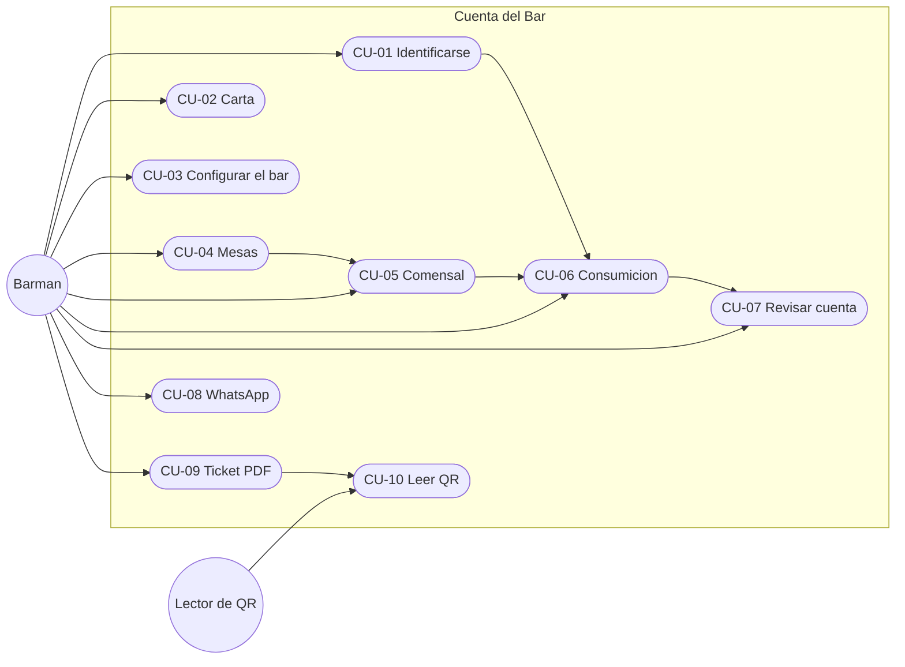

# Casos de uso

Actor principal de todos los casos: el barman, salvo que se diga otra cosa. El sistema es Cuenta del Bar.

## CU-01 Identificarse

**Objetivo:** que los pedidos queden firmados con un nombre.

**Precondición:** el nombre está en la lista de barmans. Si no, hay que darlo de alta antes.

**Flujo principal**

1. El barman abre la barra lateral, en **Quién soy**.
2. Elige su nombre en **Barman en este teléfono**.
3. El sistema muestra el nombre y la hora.

**Alternativas**

- 2a. Cierra la sesión. El sistema deja de atribuirle acciones nuevas en ese teléfono.
- 2b. Intenta apuntar un pedido sin identificarse. El sistema avisa y no guarda el cambio.

## CU-02 Mantener la carta

**Objetivo:** tener productos con icono y precio.

**Flujo principal**

1. El barman abre la pestaña **Menú**.
2. Indica icono, nombre y precio y pulsa **Guardar producto**.
3. El sistema añade el producto y lo escribe en `menu_bar.json`.

**Alternativas**

- 2a. Edita un producto existente y pulsa **Guardar cambios**. Las mesas que lo tenían pasan a usar el nombre nuevo.
- 2b. Pulsa **Eliminar producto**. Desaparece de la carta y de las mesas abiertas.
- 2c. Pulsa **Restaurar menú por defecto**. La carta vuelve a los cuatro productos de ejemplo.

## CU-03 Configurar el bar

**Objetivo:** dejar nombre, logo, WhatsApp y datos fiscales.

**Flujo principal**

1. El barman rellena el bloque correspondiente de la barra lateral.
2. Pulsa el botón de guardar de ese bloque.
3. El sistema normaliza el valor y lo escribe en `config_bar.json` o en `assets/`.

**Alternativas**

- 2a. El teléfono lleva `+`, espacios o guiones. El sistema guarda solo los dígitos.
- 2b. El NIF lleva espacios o minúsculas. El sistema guarda letras y números en mayúsculas.
- 2c. El IVA no es 0, 4, 10 ni 21. El sistema deja el 10 %.

## CU-04 Abrir y elegir mesa

**Objetivo:** tener un sitio donde colgar comensales.

**Flujo principal**

1. El barman abre **Mesas**.
2. Escribe un nombre y pulsa **Crear mesa**.
3. El sistema crea la mesa, guarda la hora de apertura, la marca como activa y anota el evento `abrir`.

**Alternativas**

- 2a. El nombre está vacío o repetido. El sistema avisa y no crea otra.
- 3a. Pulsa **Seleccionar** en otra mesa. Esa pasa a ser la activa en su navegador.
- 3b. Renombra la mesa. Se conservan comensales e historial.
- 3c. Vacía la mesa. Se van los comensales, las consumiciones y el ticket fiscal de esa cuenta. La mesa sigue.
- 3d. Cierra la mesa. El sistema la borra.

## CU-05 Sentar a un comensal

**Objetivo:** asignar una persona a una mesa.

**Precondición:** existe al menos una mesa.

**Flujo principal**

1. El barman, en **Pedido**, escribe el nombre y elige la mesa.
2. Pulsa **Asignar a mesa**.
3. El sistema crea al comensal en esa mesa, sin consumiciones, y anota `asignar`.

**Alternativas**

- 2a. Esa persona ya está en otra mesa. El sistema la mueve con sus consumiciones y anota `mover`.
- 2a. Esa persona ya está en la mesa elegida. El sistema no duplica el nombre.

## CU-06 Apuntar una consumición

**Objetivo:** sumar o corregir lo que pide una persona.

**Precondición:** hay barman identificado, mesa activa y comensal seleccionado.

**Flujo principal**

1. El barman pulsa el nombre del comensal.
2. Pulsa un producto de la carta.
3. El sistema suma una unidad, recalcula el importe y anota `añadir` con hora y barman.

**Alternativas**

- 2a. Pulsa **+** o **−** en una línea. El sistema aplica el delta. Si la cantidad llega a cero, anota `eliminar`.
- 2b. Pulsa **Quitar**. El sistema borra la línea y anota `eliminar`.
- 1a. No hay barman. El sistema muestra el aviso y no guarda nada.

## CU-07 Revisar la cuenta

**Objetivo:** comprobar importes y quién apuntó cada cosa.

**Precondición:** hay una mesa activa.

**Flujo principal**

1. El barman abre **Ticket**.
2. El sistema muestra un bloque por comensal, el total de la mesa, las métricas y el cuadre.
3. El barman abre **Trazabilidad** y ve hasta 50 eventos, del más reciente al más antiguo.

**Alternativas**

- 2a. Corrige una cantidad desde el propio ticket. El flujo sigue en CU-06.

## CU-08 Enviar la cuenta por WhatsApp

**Objetivo:** mandar el desglose a un teléfono.

**Precondición:** la mesa tiene consumiciones.

**Flujo principal**

1. El barman abre la vista previa en **Ticket**.
2. Pulsa **Abrir WhatsApp**.
3. El sistema abre el chat con el mensaje: bar, mesa, hora, barman, líneas por comensal, total y últimos 12 eventos.
4. Si hay teléfono del bar, el chat es ese número. Si no, WhatsApp pide el contacto.

## CU-09 Emitir el ticket fiscal

**Objetivo:** obtener un PDF numerado para imprimir.

**Precondición:** hay barman, la mesa tiene líneas con importe mayor que cero.

**Flujo principal**

1. El barman pulsa **Ticket térmico (80 mm)** o **Factura A4**.
2. El sistema calcula la huella de la cuenta.
3. Si esa mesa no tiene un ticket con la misma huella, reserva el siguiente número y lo guarda.
4. El sistema muestra el número emitido y los dos botones de descarga.
5. El barman descarga el PDF y lo imprime.

**Alternativas**

- 1a. Faltan razón social o NIF. El sistema avisa. Si aun así se emite, el nombre del bar ocupa el lugar de la razón social vacía.
- 1b. No hay barman o no hay importe. El sistema no emite.
- 3a. La huella coincide con el ticket ya guardado. El sistema reutiliza el número y no incrementa el contador.
- 5a. Después de emitir se cambia una cantidad o un dato fiscal de la huella. La siguiente emisión gasta un número nuevo.
- 5b. Se vacía la mesa. El ticket guardado desaparece con los comensales.

## CU-10 Leer el QR

**Actor:** quien escanea el papel. No tiene que ser el barman.

**Objetivo:** ver el contenido del ticket sin abrir la aplicación.

**Precondición:** el PDF está en pantalla o impreso, y el QR cabe entero en el encuadre.

**Flujo principal**

1. La persona enfoca el QR.
2. El lector muestra el texto: número, razón social sin tildes, NIF, dirección, fecha, mesa, barman, líneas, base, IVA y total.
3. No hay página web ni respuesta de «ticket válido». El contenido es solo ese texto.

**Alternativas**

- 2a. El papel térmico recorta el borde o el QR es de un PDF antiguo, más pequeño. El lector no descodifica. Hay que imprimir el PDF nuevo, con el QR a 68 mm.

## Resumen

Las flechas entre casos indican el orden habitual, no una inclusión formal de UML.
