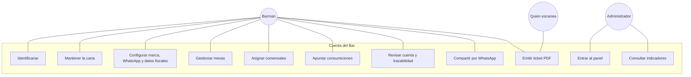
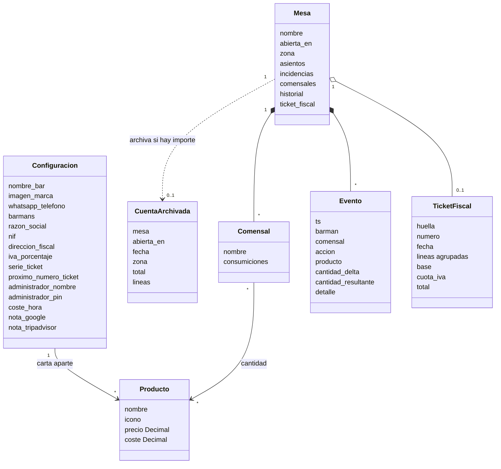
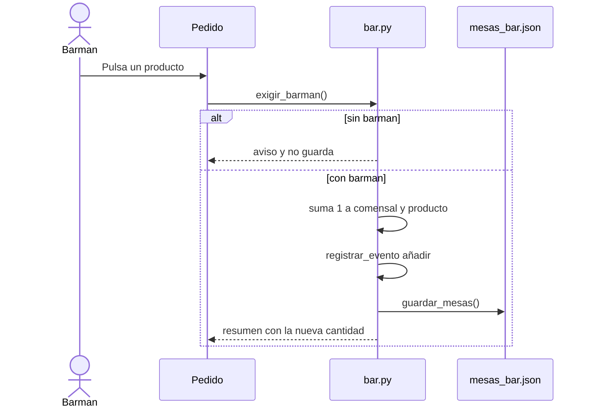
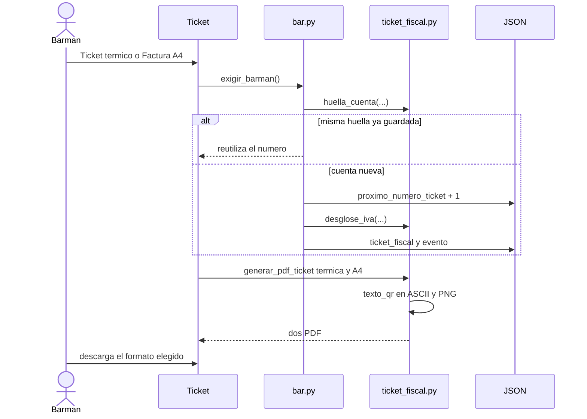
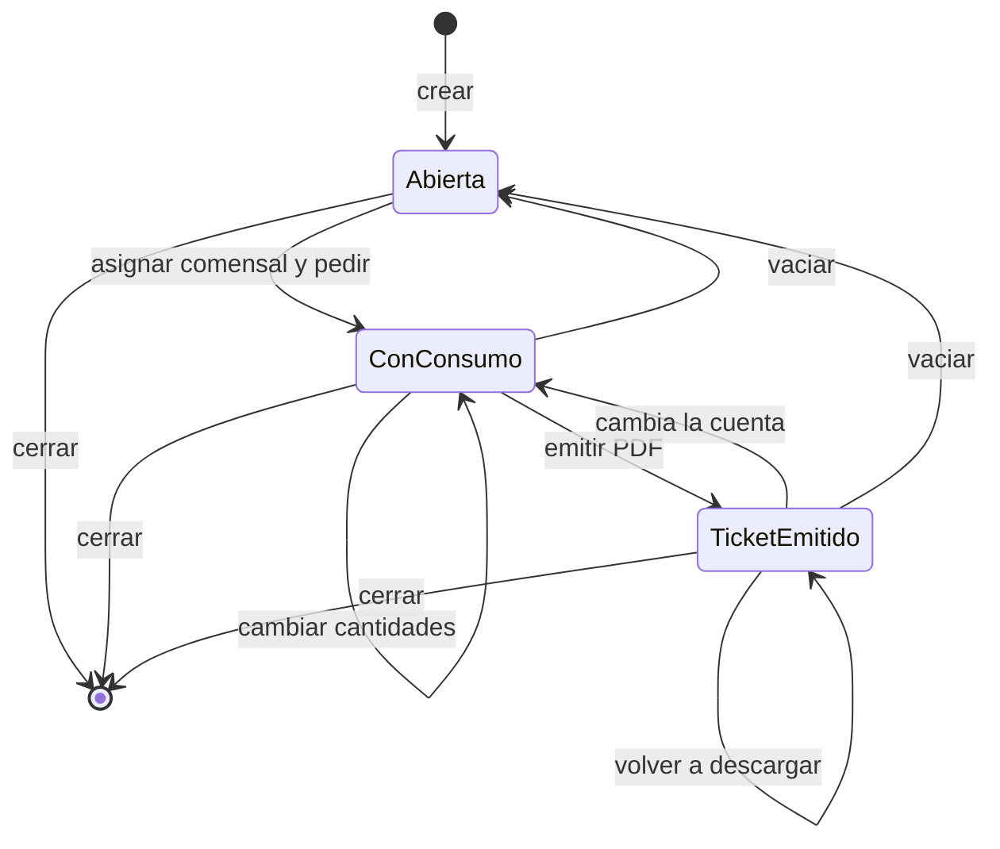
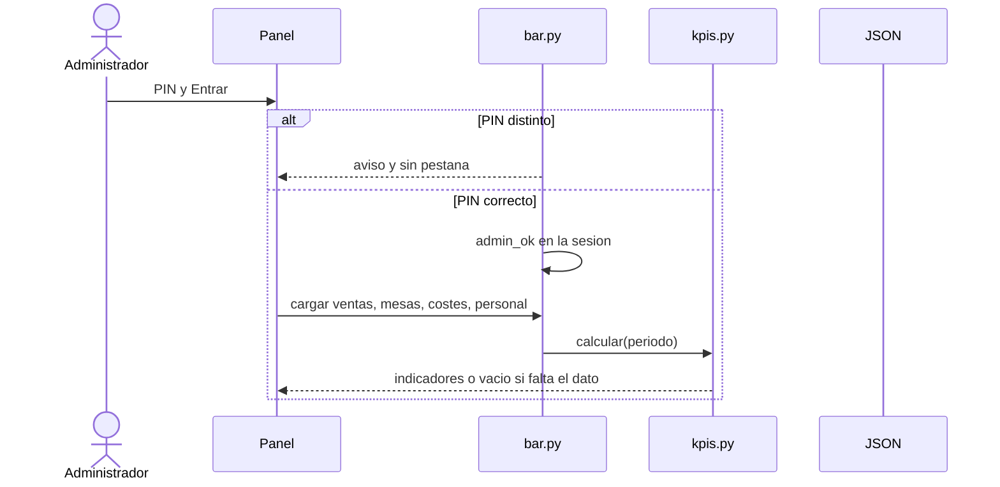
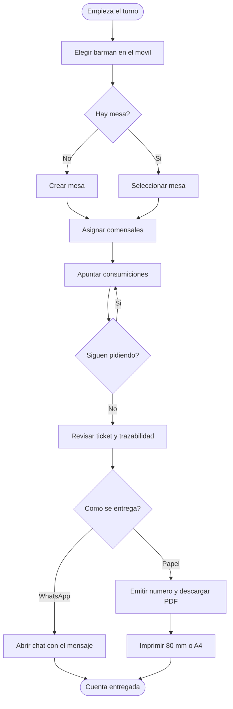
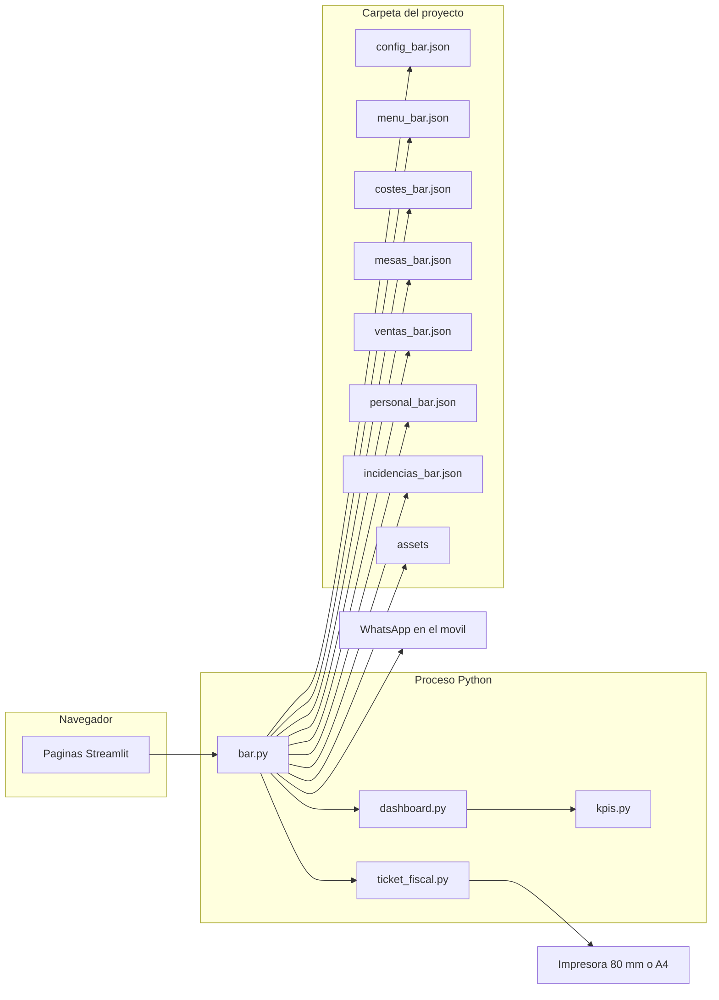
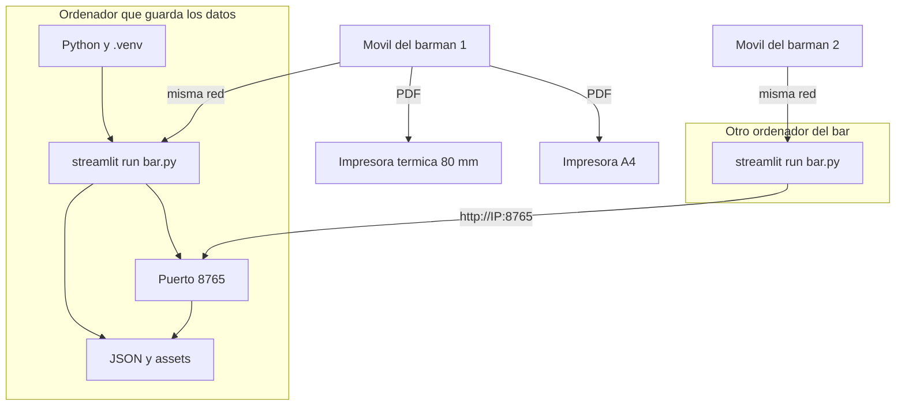

# Diagramas UML

Los diagramas describen el dominio y los flujos reales del código. La implementación no usa clases: mesas, eventos, tickets e indicadores son diccionarios en JSON, y la lógica está en funciones de `bar.py`, `kpis.py` y `ticket_fiscal.py`. El diagrama de clases es el modelo de información, no un mapa de `class` de Python.

## 1. Casos de uso

El detalle escrito de cada caso está en [casos de uso](casos-de-uso.md).

## 2. Clases del dominio

`iva_porcentaje` solo puede ser 0, 4, 10 o 21. `zona` es barra, mesas o terraza. `TicketFiscal` aparece cuando se emite y desaparece al vaciar la mesa. `CuentaArchivada` conserva esa sentada para el panel. `coste` solo existe si es mayor que 0. El PIN no se dibuja como credencial del barman: solo abre el panel.

## 3. Secuencia: apuntar una consumición

## 4. Secuencia: emitir y descargar el ticket

La primera pulsación solo emite. La descarga aparece en la recarga siguiente, porque Streamlit necesita los bytes antes de pintar el botón.

## 5. Estados de una mesa

«Cambia la cuenta» significa que cambia alguna línea, el total o un dato fiscal que entra en la huella. La mesa sigue abierta. El ticket anterior deja de valer para esa huella y la próxima emisión pide otro número. Vaciar archiva la cuenta y abre otro `abierta_en`.

## 6. Secuencia: abrir el panel

## 7. Actividad de una jornada

## 8. Componentes

WhatsApp no recibe una llamada del servidor. `bar.py` solo construye una URL `api.whatsapp.com` y el navegador la abre. La impresora tampoco está conectada al proceso: el barman descarga el PDF y lo imprime con el sistema. `dashboard.py` no importa `bar.py`: usa el módulo que Streamlit ya está ejecutando. La carta, las mesas y el número de ticket pasan por `almacen.py`. En el ordenador que guarda los ficheros, `servidor_datos.py` los publica en el puerto 8765.

## 9. Despliegue

Un ordenador del bar guarda los JSON y el correlativo del ticket, y los ofrece por el puerto 8765. El resto abre la aplicación, pega esa dirección en **Ordenadores del bar** y usa los mismos ficheros y el mismo número. El QR no es una web de comprobación: sigue siendo el texto del ticket. No hay un servicio que responda «ticket válido».
